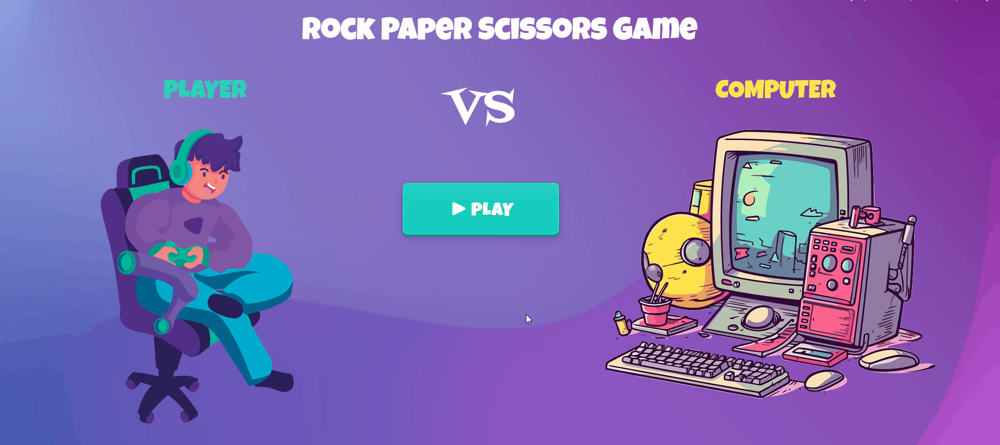

#  Rock Paper Scissors Game  

##  Overview  
Hello! This is a Rock Paper Scissors game with a basic UI design and JavaScript logic.  

##  Features  
- Simple, Basic UI  
- Player vs Computer gameplay  
- Score tracking  
- Randomized computer moves  

##  Tech Stack  
- **HTML**  
- **CSS**  
- **JavaScript**  

##  Future Improvements  
-  Add animations (transitions, effects, etc.) to make it more smooth 
-  Save scores using local storage
-  add player vs player
-  also make it responsive (working on it)

## how to use it
- Clone this repository  
   **bash**
   git clone https://github.com/your-username/rock-paper-scissors.git
-  Open index.html in your browser (just double click it or use Live Server in VS Code).

## demo preview
  
